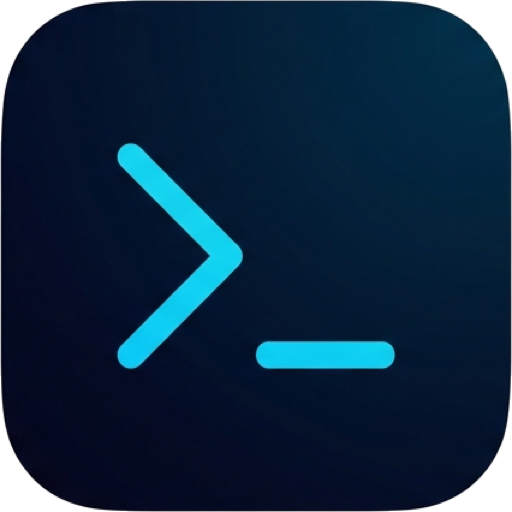
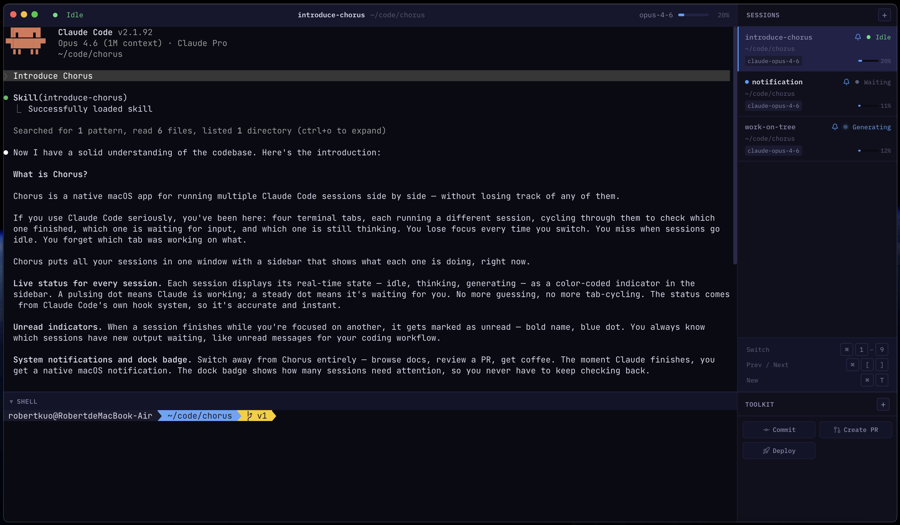

<h1 align="center">
  
  Chorus
</h1>

  Multi-session Claude Code terminal manager

  

---

**Which window was fixing that bug again?** If you run more than one Claude Code session at a time, you know the drill: `Cmd+Tab` between terminal windows, try to remember which one is writing tests vs. refactoring, check if that long-running session is still thinking or waiting for input. It's busywork that pulls you out of flow.

Chorus puts all your sessions in one window — with live status, so you never lose track.

## Features

### Live session status

Each session shows a color-coded indicator — idle, thinking, generating, waiting for input — updated in real time via Claude Code's hook system. Scan the sidebar and immediately see which sessions are working, which are done, and which need you.

### Unread indicators

When a session finishes while you're focused on another one, it gets marked as unread. You always know which sessions have new output waiting for your attention.

### System notifications

Switch away from Chorus entirely — read docs, review a PR, grab coffee — and get a native macOS notification the moment a session goes idle. A dock badge shows how many sessions need attention.

### Toolkit command panel

Save frequent commands (e.g. `/commit`, `git status`) and execute them with one click.

### Session persistence

Sessions and layout survive app restarts. Pick up right where you left off.

---

One window. Every session. Nothing missed.
